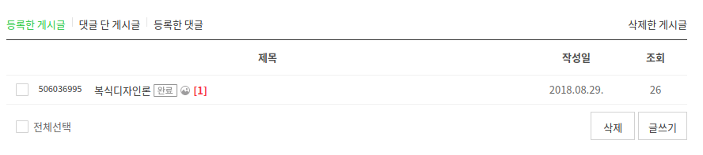
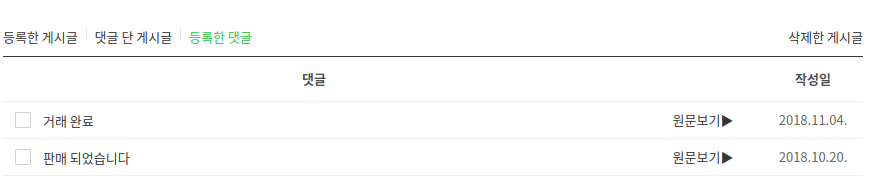
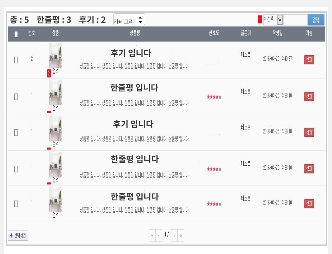

나의여행후기 | 등록한댓글

[나의여행후기] 체크박스 번호 제목 작성일 스마일 조회수

[등록한댓글]   체크박스 게시판 댓글 작성일

#### 참고사진

# 내 작성글 관리
회원과 관리자가 내 작성글(여행후기, 여행후기한줄평, 댓글)을 조회, 삭제하는 유스케이스이다

## 주 액터(Primary Actor)
회원, 관리자

## 보조 액터 (Secondary Actor)

## 사전 조건(Preconditions)
- 회원 또는 관리자로 로그인 되어 있다
- 마이페이지에 있어야 한다

## 종료 조건(Postconditions)
- 내 작성글을 조회하였다
- 내 작성글을 삭제하였다

## 시나리오(Flow of Events)

### 내작성글 조회하기
- 1. 액터가 마이페이지에서 내 작성글보기 버튼을 클릭할 때 이 유스케이스를 시작한다
- 2. 시스템은 나의여행후기 리스트를 출력한다
- 3. 액터가 등록한댓글 버튼을 클릭한다
- 4. 시스템은 등록한댓글(여행후기한줄평, 댓글) 리스트를 출력한다

#### 대안 흐름(Alternatvie Flow)
- 2.1  액터가 리스트에서 제목을 클릭한다
    - 시스템은 '여행후기 상세조회' 유스케이스로 간다
- 2.2 액터가 검색창에 검색어를 입력하고 검색 버튼을 클릭한다.
    - 시스템은 제목에 검색어가 포함 된 나의여행후기 리스트를 출력한다
- 3.1 액터가 리스트에서 (여행후기한줄평)댓글을 클릭 하였다면,  
    - 시스템은 '현지투어상품 상세조회' 유스케이스 (?)번으로 간다
- 3.2 액터가 리스트에서 댓글을 클릭하였다면,  
    - 시스템은 '여행후기 상세보기' 유스케이스 (?) 번으로 간다

### 내작성글 삭제하기
- 1. 액터는 마이페이지의 내 작성글보기 리스트에서 삭제하고 싶은 작성글을 체크하고 삭제 버튼을 누른다
- 2. 시스템은 해당 글을 삭제한 후 '내작성글 조회하기' 유스케이스의 2번으로 간다.
      - 해당 글이 없으면,  
          - 시스템은 삭제할 글이 없음을 알린다

