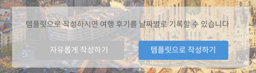
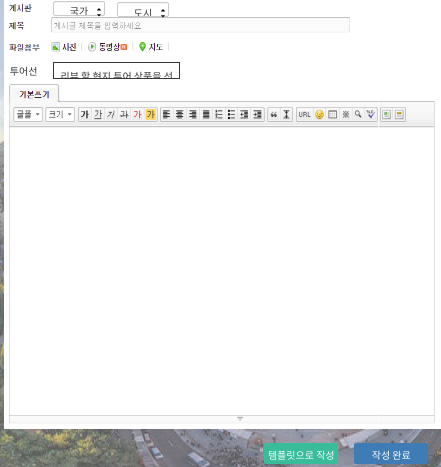
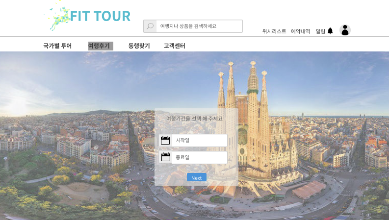
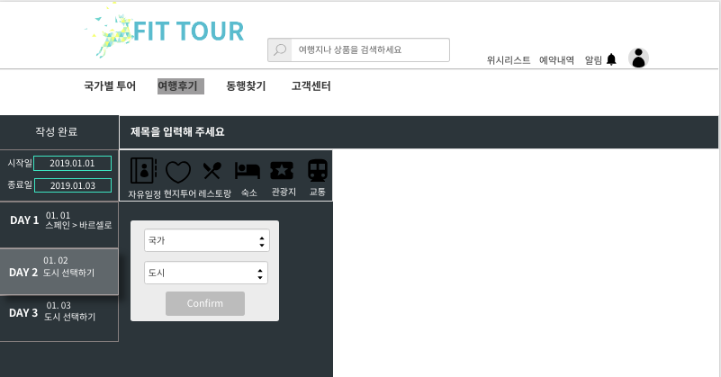
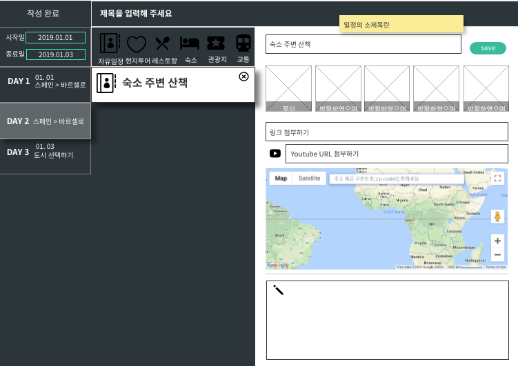
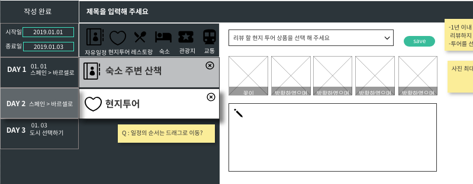
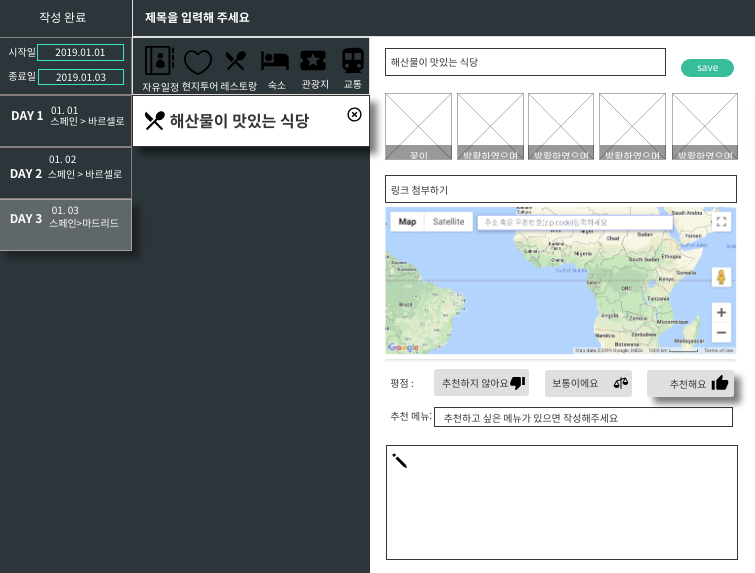
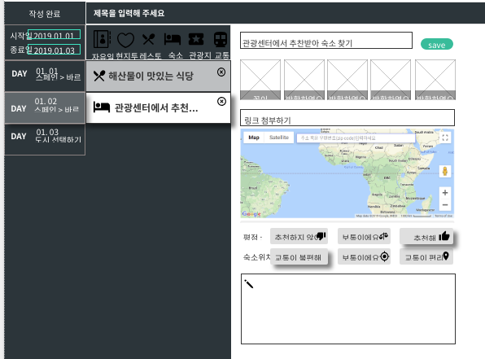
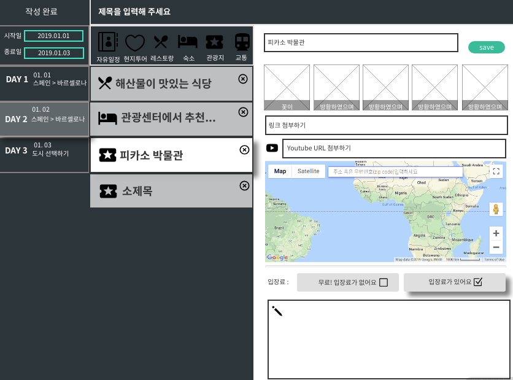
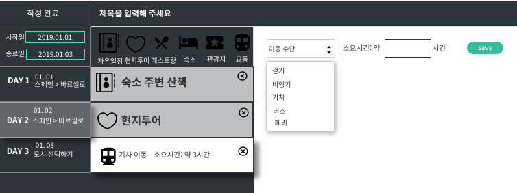

# 여행후기 관리
회원과 관리자가 여행 후기를 등록, 변경, 삭제하는 유스케이스이다

## 주 액터(Primary Actor)
회원, 관리자

## 보조 액터 (Secondary Actor)
구글맵, 유투브, 링크 

## 사전 조건(Preconditions)
- 회원 또는 관리자로 로그인 되어 있다
- 여행후기 페이지에 있어야 한다

## 종료 조건(Postconditions)
- 여행후기를 등록하였다
- 여행후기를 변경하였다
- 여행후기를 삭제하였다

## 시나리오(Flow of Events)

### 여행후기 등록하기
1. 액터는 여행후기조회 페이지에서 나의여행후기작성하기 버튼을 클릭한다
2. 시스템은 여행후기 등록 템플릿을 선택(자유롭게 작성하기, 템플릿으로 작성하기)할 수 있는 폼을 출력한다

#### 자유롭게 작성하기로 여행후기 등록하기
1. 액터가 자유롭게 작성하기 버튼을 클릭하였다면 시스템은 자유롭게 작성하기 여행후기 등록 폼을 출력한다
    - 1.1 액터가 해당 사이트에서 현지투어상품을 1년 이내에 이용한 적이 있고, 리뷰를 작성한 적이 없다면 
       - 시스템은 액터가 이용한 현지투어상품 리스트를 출력한다
            - 1.1.1 액터가 현지투어상품을 리뷰하겠다고 선택하면
                 - 시스템은 현지투어상품리뷰 폼도 현재창에 출력한다
         - 1.1.2 액터가 현지투어상품을 리뷰하겠다고 선택하지 않으면
             - 시스템은 현지투어상품리뷰 폼을 출력하지 않는다
    - 1.2 액터가 해당 사이트에서 현지투어상품을 1년 이내에 이용한 적이 있고, 리뷰를 작성한 적이 있거나, 현지투어상품을 1년 이내에 이용한 적이 없다면 
        - 시스템은 리뷰할여행상품이 없음을 알리고 리뷰 폼을 출력하지 않는다

2. 사용자가 국가, 도시를 선택하고, 제목, 사진, 유투브 링크, 지도를 첨부하고, 현지투어상품리뷰, 내용을 입력하고 등록 버튼을 누른다
    - 2.1 사용자가 템플릿으로작성을 클릭하면 '템플릿으로 작성하기로 여행후기 등록하기' 유스케이스로 간다

3. 시스템은 여행후기 정보를 저장한 후 '여행후기 조회하기' 유스케이스의 (?)번으로 간다.
      - 3.1 필수 입력 항목(국가, 도시, 제목, 현지투어상품리뷰(1.1.1인 경우), 내용)이 비어 있다면,
           - 시스템은 필수 입력 항목이 비어 있음을 알린다

           
#### 자유롭게 작성하기로 작성한 여행후기 수정하기
1. 액터는 여행후기 수정 화면에서 국가, 도시, 제목, 사진, 유투브링크, 지도, 투어선택, 현지투어리뷰, 내용을 변경한다
2. 시스템은 여행후기 정보를 변경한 후 '여행후기 조회하하기' 유스케이스의 (?) 번으로 간다
    - 2.1 필수 입력 항목(국가, 도시, 제목, 현지투어상품리뷰(자유롭게 작성하기로 여행후기 등록하기 1.1.1 인 경우), 내용)이 비어 있다면,
      - 시스템은 필수 입력 항목이 비어 있음을 알린다

#### 템플릿으로 작성하기로 여행후기 등록하기
1. 액터가 템플릿으로 작성하기 버튼을 클릭하였다면,
2. 시스템은 여행기간을 선택하는 폼을 출력한다

3. 액터는 (여행)시작일과 종료일을 선택하고 Next 버튼을 누른다
4. 시스템은 사용자가 선택한 시작일과 종료일에 맞춰 날짜 탭을 포함한 작성 폼을 출력한다
    - (시작일,종료일,시작일과 종료일에 따른 날짜탭, 제목, 자유일정, 현지투어, 레스토랑, 숙소, 관광지, 교통)
5. 액터가 시작일과 종료일을 클릭하면
    - 5.1 시스템은 날짜를 선택하고 변경 할 수 있는 폼을 현재창에 출력한다
    - 5.2 사용자가 시작일과 종료일을 선택하면
    - 5.3 시스템은 새롭게 선택한 날짜에 맞춰 날짜탭을 출력한다
6. 액터가 도시선택하기를 클릭하면
    - 6.1 시스템은 국가, 도시를 선택할 수 있는 폼을 현재창에 출력한다
    - 6.2 사용자는 국가와 도시를 선택하면
    - 6.3. 시스템은 사용자가 선택한 국가와 도시를 출력한다
7. 액터가 원하는 일정유형(자유일정,현지투어,레스토랑,숙소,관광지,교통)을 선택하면
    - 7.1 시스템은 해당하는 작성 폼을 현재창에 출력한다
    - 7.2 사용자는 정보를 입력하고 save 버튼을 클릭한다
    - 7.3 시스템은 상세정보를 저장한다
           - 여기서 발생하는 기본, 대체, 예외흐름은 아래의 명세서로 대체한다

8. 액터가 작성완료를 클릭한다
9. 시스템은 정보를 저장하고 '여행후기 조회하기' 유스케이스의 (?)번으로 간다
    - 필수 항목(제목, 도시, 국가, 최소 1 개의 일정)이 비어 있다면,
         - 시스템은 필수 항목이 비어 있음을 알린다

##### 자유일정 등록하기
1. 액터가 자유일정 버튼을 클릭하였다면
2. 시스템은 자유일정 등록 폼을 출력한다
   - 소제목, 사진(최대 5개), 유투브링크, 링크, 지도, 내용
3. 액터가 정보를 입력하고 save 버튼을 클릭한다
4. 시스템은 자유일정 정보를 저장한다
    - 필수 항목 (소제목, 내용)이 비어 있다면,
       - 시스템은 필수 항목이 비어 있음을 알린다
      
      ###### 대안흐름
      3.1 액터가 정보를 입력하고 (save 버튼을 누르지 않고 바로) 작성완료를 클릭한다.
      3.2 시스템은 자유일정 정보를 저장하고 '여행후기 조회하기' 유스케이스의 (?) 번으로 간다
        - 필수 입력 항목(소제목, 내용)이 비어있다면,
              - 시스템은 필수 입력 항목이 비어 있음을 알린다
    
      ###### 예외흐름
      3.1 액터가 내용을 입력하고 (save 버튼을 누르지 않고) 다른 일정 등록 버튼을 클릭한다
      3.2 시스템은 해당 일정이 저장되지 않았음을 알린다      

##### 현지투어 등록하기
1. 액터가 현지투어 등록하기 버튼을 클릭한다
2. 시스템은 현지투어 후기 등록 폼을 출력한다
   - 현지투어선택, 사진(최대 5개), 내용
   - 액터가 해당 사이트에서 이용한 현지투어상품이 없다면
        - 시스템은 리뷰 할 현지투어 상품이 없음을 선택탭에 출력한다
3. 액터가 리뷰할현지투어상품을 선택한다
4. 액터가 사진첨부, 내용을 입력하고 save 버튼을 클릭한다
5. 시스템은 현지투어 정보를 저장한다
    - 액터가 리뷰할현지투어상품을 선택하지 않았다면
       - 시스템은 선택된 여행상품이 없음을 알린다
    - 필수 항목 (내용)이 비어 있다면,
       - 시스템은 필수 항목이 비어 있음을 알린다
      
      ###### 대안흐름
      4.1 액터가 정보를 입력하고 (save 버튼을 누르지 않고 바로) 작성완료를 클릭한다.

      4.2 시스템은 현지투어 정보를 저장하고 '여행후기 조회하기' 유스케이스의 (?) 번으로 간다
       - 액터가 리뷰할현지투어상품을 선택하지 않았다면
              - 시스템은 선택된 여행상품이 없음을 알린다
        - 필수 입력 항목(내용)이 비어있다면,
              - 시스템은 필수 입력 항목이 비어 있음을 알린다
    
      ###### 예외흐름
      2.1 액터가 해당 사이트에서 이용한 현지투어상품이 없다면
          - 시스템은 리뷰 할 현지투어 상품이 없음을 선택탭에 출력한다

      4.1 사용자가 내용을 입력하고 (save 버튼을 누르지 않고) 다른 일정 등록 버튼을 클릭한다
      4.2 시스템은 해당 일정이 저장되지 않았음을 알린다
      

##### 레스토랑 등록하기
1. 액터가 레스토랑 버튼을 클릭하였다면
2. 시스템은 레스토랑 후기 등록 폼을 출력한다
   - 소제목, 사진(최대 5개), 링크, 지도, 평점선택(추천하지 않아요, 보통이에요, 추천해요), 추천메뉴, 내용
3. 액터가 정보를 입력하고 save 버튼을 클릭한다
4. 시스템은 레스토랑 정보를 저장한다
    - 필수 항목 (소제목, 평점선택, 내용)이 비어 있다면,
       - 시스템은 필수 항목이 비어 있음을 알린다
      
      ###### 대안흐름
      3.1 액터가 정보를 입력하고 (save 버튼을 누르지 않고 바로) 작성완료를 클릭한다.
      3.2 시스템은 레스토랑 정보를 저장하고 '여행후기 조회하기' 유스케이스의 (?) 번으로 간다
        - 필수 입력 항목(소제목, 평점선택, 내용)이 비어있다면,
              - 시스템은 필수 입력 항목이 비어 있음을 알린다
    
      ###### 예외흐름
      3.1 액터가 내용을 입력하고 (save 버튼을 누르지 않고) 다른 일정 등록 버튼을 클릭한다
      3.2 시스템은 해당 일정이 저장되지 않았음을 알린다
      

##### 숙소 등록하기
1. 액터가 숙소 버튼을 클릭하였다면
2. 시스템은 숙소 후기 등록 폼을 출력한다
   - 소제목, 사진(최대 5개), 링크, 지도, 평점선택(추천하지 않아요, 보통이에요, 추천해요), 숙소위치선택(교통이불편해요,보통이에요,교통이편리해요), 내용
3. 액터가 정보를 입력하고 save 버튼을 클릭한다
4. 시스템은 숙소 정보를 저장한다
    - 필수 항목 (소제목, 평점선택, 숙소위치선택, 내용)이 비어 있다면,
       - 시스템은 필수 항목이 비어 있음을 알린다
      
      ###### 대안흐름
      3.1 액터가 정보를 입력하고 (save 버튼을 누르지 않고 바로) 작성완료를 클릭한다.
      3.2 시스템은 숙소 정보를 저장하고 '여행후기 조회하기' 유스케이스의 (?) 번으로 간다
        - 필수 입력 항목(소제목, 평점선택, 숙소위치선택, 내용)이 비어있다면,
              - 시스템은 필수 입력 항목이 비어 있음을 알린다
    
      ###### 예외흐름
      3.1 액터가 내용을 입력하고 (save 버튼을 누르지 않고) 다른 일정 등록 버튼을 클릭한다
      3.2 시스템은 해당 일정이 저장되지 않았음을 알린다
      

##### 관광지 등록하기
1. 액터가 관광지 버튼을 클릭하였다면
2. 시스템은 관광지 후기 등록 폼을 출력한다
   - 소제목, 사진(최대 5개), 링크, 유투브링크, 지도, 입장료선택(무료!입장료가없어요, 입장료있어요), 내용
3. 액터가 정보를 입력하고 save 버튼을 클릭한다
4. 시스템은 레스토랑 정보를 저장한다
    - 필수 항목 (소제목, 입장료선택, 내용)이 비어 있다면,
       - 시스템은 필수 항목이 비어 있음을 알린다
      
      ###### 대안흐름
      3.1 액터가 정보를 입력하고 (save 버튼을 누르지 않고 바로) 작성완료를 클릭한다.
      3.2 시스템은 관광지 정보를 저장하고 '여행후기 조회하기' 유스케이스의 (?) 번으로 간다
        - 필수 입력 항목(소제목, 입장료선택, 내용)이 비어있다면,
              - 시스템은 필수 입력 항목이 비어 있음을 알린다
    
      ###### 예외흐름
      3.1 액터가 내용을 입력하고 (save 버튼을 누르지 않고) 다른 일정 등록 버튼을 클릭한다
      3.2 시스템은 해당 일정이 저장되지 않았음을 알린다
      

##### 교통 등록하기
1. 액터과 교통 버튼을 클릭하였다면
2. 시스템은 교통 등록 폼을 출력한다
    - 이동수단선택, 소요시간
3. 액터가 정보를 입력하고 save 버튼을 클릭한다
4. 시스템은 교통 정보를 저장한다
   - 필수 항목 (이동수단선택, 소요시간)이 비어있다면,
            - 시스템은 필수 입력 항목이 비어 있음을 알린다
      
      ###### 대안흐름
      3.1 액터가 정보를 입력하고 (save 버튼을 누르지 않고 바로) 작성완료를 클릭한다.
      3.2 시스템은 관광지 정보를 저장하고 '여행후기 조회하기' 유스케이스의 (?) 번으로 간다
        - 필수 입력 항목(이동수단선택, 소요시간)이 비어있다면,
              - 시스템은 필수 입력 항목이 비어 있음을 알린다
    
      ###### 예외흐름
      3.1 액터가 내용을 입력하고 (save 버튼을 누르지 않고) 다른 일정 등록 버튼을 클릭한다
      3.2 시스템은 해당 일정이 저장되지 않았음을 알린다
      

#### 템플릿으로 작성한 여행후기 변경하기

[공통내용]

1. 사용자는 시작일,종료일,국가,도시,제목, 일정변경과 삭제, 일정의순서를 변경하고 작성완료를 클릭한다
2. 시스템은 정보를 변경한 후 '여행후기 조회하기' 유스케이스의 (?) 번으로 간다
    - 필수 항목(제목, 도시, 국가, 최소 1 개의 일정)이 비어 있다면,
         - 시스템은 필수 항목이 비어 있음을 알린다

##### 일정 순서 변경하기
1. 사용자는 2번째 컬럼에서 일정을 드래그하여 순서를 변경하고 작성완료를 클릭한다
2. 시스템은 변경된 순서를 저장하고 '여행후기 조회하기' 유스케이스의 (?) 번으로 간다

##### 일정 삭제하기
1. 사용자가 2번째 컬럼에서 X 버튼을 클릭한다
2. 시스템은 해당 일정을 삭제한다

[개별내용]
##### 자유일정 변경하기
1. 액터는 자유일정 상세 정보 화면에서 소제목, 사진, 유투브링크, 링크, 지도, 내용을 변경하고 save 버튼을 클릭한다
2. 시스템은 자유일정 정보를 변경한다
       - 사용자가 리뷰할현지투어상품을 선택하지 않았다면
              - 시스템은 선택된 여행상품이 없음을 알린다
        - 필수 입력 항목(내용)이 비어있다면,
              - 시스템은 필수 입력 항목이 비어 있음을 알린다

##### 현지투어 변경하기
1. 액터는 현지투어 상세 정보 화면에서 현지투어선택, 사진, 내용을 변경하고 save 버튼을 클릭한다
2. 시스템은 자유일정 정보를 변경한다
     - 필수 입력 항목(소제목, 내용)이 비어 있다면,
         - 시스템은 필수 입력 항목이 비어 있음을 알린다

##### 레스토랑 변경하기
1. 액터는 레스토랑 상세 정보 화면에서 소제목, 사진, 링크, 지도, 평점선택, 추천메뉴, 내용을 변경하고 save 버튼을 클릭한다
2. 시스템은 레스토랑 정보를 변경한다
    - 필수 입력 항목(소제목, 평점선택, 내용)이 비어있다면,
        - 시스템은 필수 입력 항목이 비어 있음을 알린다

##### 숙소 변경하기
1. 액터는 숙소 상세 정보 화면에서 소제목, 사진, 링크, 지도, 평점선택, 숙소위치선택, 내용을 변경하고 save 버튼을 클릭한다
2. 시스템은 레스토랑 정보를 변경한다
        - 필수 입력 항목(소제목, 평점선택, 숙소위치선택, 내용)이 비어있다면,
              - 시스템은 필수 입력 항목이 비어 있음을 알린다

##### 관광지 변경하기
1. 액터는 관광지 상세 정보 화면에서 소제목, 사진, 링크, 유투브링크, 지도, 입장료선택, 내용을 변경하고 save 버튼을 클릭한다
2. 시스템은 레스토랑 정보를 변경한다
        - 필수 입력 항목(소제목, 입장료선택, 내용)이 비어있다면,
              - 시스템은 필수 입력 항목이 비어 있음을 알린다

##### 교통 변경하기
1. 액터는 교통 상세 정보 화면에서 이동수단선택, 소요시간을 변경하고 save 버튼을 클릭한다
2. 시스템은 레스토랑 정보를 변경한다
        - 필수 입력 항목(이동수단, 소요시간)이 비어있다면,
              - 시스템은 필수 입력 항목이 비어 있음을 알린다

#### 여행후기 삭제하기
1. 액터는 여행후기 상세 정보 화면에서 삭제 버튼을 클릭한다
2. 시스템은 해당 여행후기를 삭제한 후 '여행후기 조회하기' 유스케이스의 (?) 번으로 간다
   - 해당 여행후기가 없으면,
      - 시스템은 여행후기가 없음을 알린다

